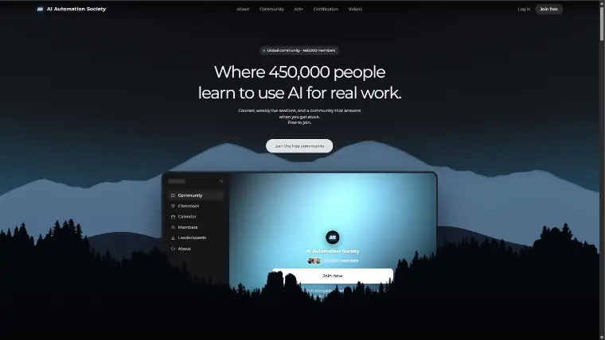
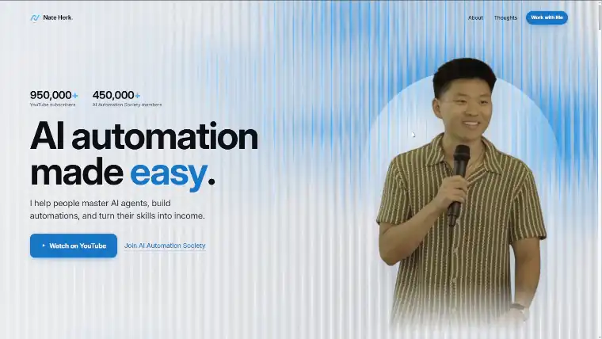

# scroll-craft

**An agent skill for building premium, scroll-driven websites, with a real design standard.**

Use it with Codex, Claude Code, or another coding agent that can read instructions,
edit files, run commands, and inspect a browser. The skill contains the design
workflow, references, engine, and verification tools. It also ships as a Claude
Code plugin for convenient installation.

Most AI website output fails in one of two directions. It is either well behaved and forgettable, or it is a flashy scroll animation with 2.1:1 body text, a headline that wraps to six lines on a phone, and the same six sections every other AI page has. scroll-craft is built to fail neither way: it treats **interaction** and **craft** as one job rather than two.

[](LICENSE)
[](plugins/nateherk-design/skills/scroll-craft/SKILL.md)
[](https://code.claude.com/docs/en/plugins)

---

## New in 0.3.0: the approved ten-site standard

The skill now includes the process behind ten approved immersive websites:
AI Automation Society, PERKFORM, Glaido, Herkules Advisory, Serein, FORME,
Pelagic, NOEMA, OFFGRID, and Afterhours.

### See the worked examples in motion

A 50-second walkthrough of several approved sites, showing their layered heroes,
pointer response, and scroll transitions.

https://github.com/user-attachments/assets/d193073b-5af9-45de-93ae-95bf7c6934d5

- Plan independent depth planes, contact anchors, and opening/midpoint/exit states.
- Use authentic brand assets and verified product details before generating imagery.
- Choose photographic compositing or real 3D rendering to suit the subject.
- Give each site its own navigation, information order, useful controls, and ending.
- Art-direct phones separately and verify actual scroll frames, fallbacks, and packages.
- Honor explicit creative delegation without forcing a redundant interview.

Read the [worked examples and production workflow](plugins/nateherk-design/skills/scroll-craft/references/approved-collection.md)
and the [hero-depth guide](plugins/nateherk-design/skills/scroll-craft/references/hero-depth.md).
These examples describe design behavior; client assets and private form data are
not bundled. The existing engine and video compatibility fixes are preserved.

## Three builds, three completely different pages

Same skill, same engine, no shared skeleton. The differences below are not themes: they are different page grammars, different navigation models, different endings.

### [AI Automation Society](https://aiautomationsociety.ai) · an AI community
A dark editorial landing for a 450,000-member community. One stat carries the whole promise, a live product surface rises into the frame, and the proof stacks under it as you fall down the page.



### [Nate Herk](https://www.nateherk.com) · a creator portfolio
High-key and bright, the opposite of the first. A lit-glass hero with the numbers up front, a portrait held in the light, and two clear next steps instead of a wall of links.



### PERKFORM · a protein coffee
A filmic one-shot that hard-cuts to two full-bleed inverted grounds mid-page. Loud, product-forward, and the only one of the three that raises its voice.


---

## What it actually does

**Interaction, engagement, and being unrepeatable**

- **Scroll is the timeline.** Video scrubs frame by frame under the wheel, sections pin while their argument advances, rails pan sideways, headlines assemble line by line, the page ground shifts colour as you travel, and the pointer moves things that are not scrolling.
- **Eight mutually exclusive page grammars.** Filmic one-shot, chaptered editorial, live surface, continuous world, typographic poster, gallery, split stage, rhythmic cutlist. Each one *forbids* what the others require, so two builds cannot quietly converge.
- **A required signature move.** Every build invents one bespoke interaction that exists on that site alone. A recoloured spotlight does not count.
- **A fingerprint gate.** A new build must differ from every page you have already made on at least 4 of 6 dimensions: grammar, nav, hero, act shape, close, signature move. Fail it and you change the plan, not the record.

**Craft, and how the page actually feels**

- **A feeling curve before any act exists.** One line per act: the emotion, then what on screen causes it. Two adjacent acts with the same feeling means one is filler.
- **One engineered peak.** Peak-end rule, applied literally. The peak gets the asset budget, the silence in front of it, and the most scroll room. A page with three peaks has none.
- **A typography floor.** Two families maximum, tracking that tightens as size grows, 45 to 75ch measure, line height inverse to measure, and light-on-dark compensated on three axes.
- **A spacing scale with actual rhythm.** 4px base, more space above a heading than below it, fluid section padding so a phone does not inherit desktop air.
- **Colour with six roles and one accent**, secondary text tinted rather than flat grey, no pure black, and a documented escape for pages that hard-cut between light and dark grounds.
- **Depth as five tools, not one.** Offset shadows, edge light, scale-and-blur as distance, overlap, and grain.
- **Brand guidelines are inputs, not decoration.** Point it at a brand kit and its hard rules win, including rules that forbid things the skill would otherwise reach for.
- **A refuse list.** Identical feature-card grids, `01 / 06` counters, scroll cues, gradient text, em dashes, invented statistics, fake dashboards, AI-purple gradients, and the cream-and-brass artisan palette every craft brand defaults to.

**It checks its own work**

A headless browser walks the finished page at every scroll position, waits for the video playhead to settle, and reports:

- **dead scroll**: scroll that changes nothing on screen
- **cues that never reach full opacity**: copy the reader can only ever see faded
- **contrast measured on the composited page**, per line, at the brightest frame that ever passes under it, with the direction picked per line so light-on-dark and dark-on-light are both graded correctly
- **legs stuck on a poster**: a clip that silently never decoded, which looks exactly like a paused film

Then it writes a contact sheet, because a machine can prove a page works and cannot tell you it means anything.

---

## Install

### Codex and other coding agents

Clone or download this repository. The complete skill lives in
[`plugins/nateherk-design/skills/scroll-craft/`](plugins/nateherk-design/skills/scroll-craft/).
Keep that folder intact, including its references, scripts, templates, and engine.

- **Codex:** copy the complete `scroll-craft` folder into your project's
  `.agents/skills/` directory, then ask Codex to use the Scrollcraft skill.
- **Other agents with skill support:** place the folder in the agent's documented
  skill directory.
- **Any coding agent with file access:** leave the repository in your workspace
  and ask it to read and follow the skill directly:

```text
Read plugins/nateherk-design/skills/scroll-craft/SKILL.md and use it to build
my website. Follow the referenced design and verification workflow.
```

Adjust the path if the repository is in a subfolder. Agents use their own tools
for file access, shell commands, browser inspection, and user questions. The
design workflow is shared; tool names and automatic skill discovery can differ.
The ten-site rebuild documented here was built with Codex.

### Claude Code plugin

```bash
/plugin marketplace add nateherkai/scroll-craft
```
```bash
/plugin install nateherk-design
```

Then use it by describing what you want, or invoke it directly:

```
/nateherk-design:scroll-craft
```

If the install summary says `Run /reload-plugins to activate.`, run that.

To hack on the skill without installing:

```bash
claude --plugin-dir ./plugins/nateherk-design
```

## First run

From this repository's root, run:

```bash
node plugins/nateherk-design/skills/scroll-craft/scripts/doctor.mjs
node plugins/nateherk-design/skills/scroll-craft/scripts/workspace.mjs --ensure
```

If you installed the skill elsewhere, use that folder's `scripts/` path instead.

Run `doctor` before anything else. The three most common setup faults all surface later as misleading errors otherwise: a stripped ffmpeg reports a missing filter as a syntax error in *your* command, a missing WebP muxer reports as a bad filename, and `playwright-core` resolves from the wrong directory.

## Requirements

| | Why | Notes |
| --- | --- | --- |
| **Node 18+** | every script | |
| **A full ffmpeg build** | encoding clips so they *scrub* rather than play | Some toolchains put a stripped ffmpeg on PATH with ~50 filters and no `scale`. `doctor` finds a real build if one exists; `SCROLLCRAFT_FFMPEG` overrides. |
| **`playwright-core` + Chrome** | the verification pass | `npm i playwright-core` **in the build folder** |
| **`KIE_AI_API_KEY`** | only if you want assets *generated* | Optional. Building from your own photos and footage needs no key and no spend, and it is a first-class route. See `.env.example`. |

## The workspace

Your builds and your fingerprint registry live in one directory, resolved rather than assumed. First hit wins:

1. `SCROLLCRAFT_HOME`
2. the nearest `.scrollcraft.json` walking up from the current directory: `{ "workspace": "path/to/builds" }`
3. `<project root>/scrollcraft`

Builds land in `<workspace>/builds/<name>/`; your registry is `<workspace>/FINGERPRINTS.md`.

**Your registry starts empty, and that is correct.** The gate exists to stop you repeating *yourself*, so your first build has nothing to clear and every build after it does. [`EXAMPLES.md`](EXAMPLES.md) is the author's twelve-row table, included so you can see what a filled registry looks like and which shapes tend to collide. It is illustration, not constraint.

## What is in here

```
plugins/nateherk-design/
└── skills/scroll-craft/
    ├── SKILL.md            the procedure: brief, grammar, score, build, verify
    ├── references/
    │   ├── approved-collection.md  the ten-site workflow and worked examples
    │   ├── hero-depth.md   independent planes, contact anchors, mobile composition
    │   ├── uniqueness.md   eight page grammars, the signature move, the fingerprint gate
    │   ├── feel.md         the feeling curve, the engineered peak, the feel check
    │   ├── devices.md      nine scroll devices and the cue contract
    │   ├── worldflight.md  continuous-world mode: one fixed stage, no seams
    │   ├── worlds.md       art direction, and the style-preamble method
    │   ├── taste.md        the design floor: spacing, type, colour, depth, motion
    │   ├── assets.md       generation, camera moves, encoding for scrubbing
    │   ├── verify.md       the harness, and what it cannot tell you
    │   └── template.html   a starting skeleton, not a layout
    ├── engine/             scrollcraft.js + .css. The mechanism, never edited per project
    ├── templates/          the empty registry a new workspace is seeded from
    └── scripts/            doctor · workspace · kie · encode · serve · shoot · worldflight-assert
```

[`CHANGELOG.md`](plugins/nateherk-design/skills/scroll-craft/CHANGELOG.md) is worth reading on its own: it records what broke on each build and the rule that came out of it, rather than a feature list.

## The one rule that matters most

The engine is the mechanism and it is **never edited per project**. Theme it with six colour tokens and two fonts, write your own semantic HTML, and drive anything bespoke off the `--sc-p` custom property the engine publishes. A runtime that builds the page from a config object is exactly why every site built on one looks the same.

## Honest limitations

- **Only ever run on Windows.** The scripts look for ffmpeg and Chrome in Windows, macOS and Linux locations, but no build has been done on a Mac. `SCROLLCRAFT_FFMPEG` and `SCROLLCRAFT_CHROME` override the search.
- **Generated video is not free.** A ten-leg continuous-world flight is a real spend. A page built from your own assets costs nothing.
- **It is opinionated on purpose.** It will refuse the layouts and palettes that make AI pages recognisable, and it will argue with you about your peak. If you want a page that looks like everything else, this is the wrong tool.

## Licence

MIT. See [LICENSE](LICENSE).
